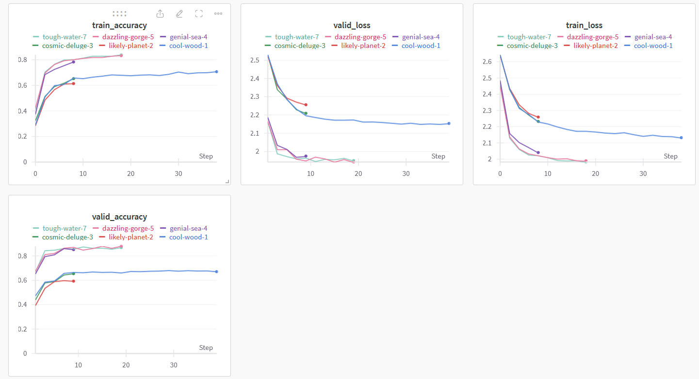

# Tarea imágenes Deep Learning

---

Para esta tarea hemos entrenado un modelo con 10 `epochs` y 5 `unfreezed_layers` como modelo final.

Otros modelos fueron entrenados pero este fue el que más accuracy dio, 0.88 en el conjunto de validación. Ver la siguiente figura de Weights&Biases.

Para usar el repositorio es necesario tener el modelo (que no hemos subido debido al límite de almacenamiento de GitHub). Por otro lado, intentamos cambiar parte de la arquitectura de la red pero no resultó en ninguna mejora sustancial.

Una de las partes que nos quedaron por probar puede ser cambiar el modelo preentrenado por alguno más pesado como puede ser el `resnet152`. Hasta el momento no hemos conseguido usarlo debido a la gran cantidad de tiempo de ejecución necesaria para usar este tipo de modelos.

## Cómo hacer predicciones

Para usar el código, debes tener el modelo en el directorio `03TransferLearning/models/tu_modelo.pt`, además del dataset en `03TransferLearning/dataset/training` y `03TransferLearning/dataset/validation`. Para cargar la imagen, se guarda en la carpeta `03TransferLearning/dataset/test/Living Room/tu_imagen.png`.

Para correr el código de Streamlit, hay que estar dentro de la carpeta `streamlit/intro_app/` y hacer `streamlit run app.py`
